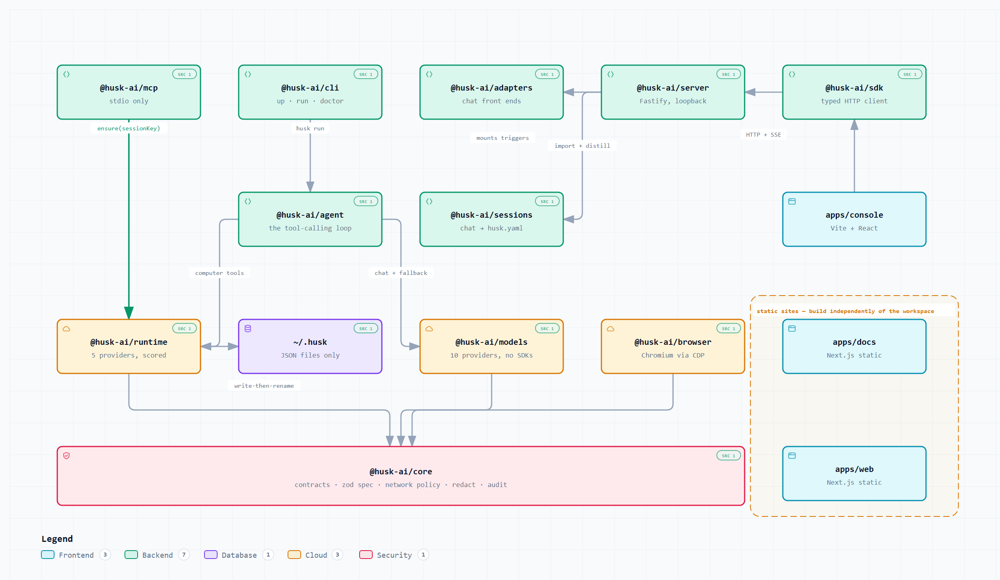
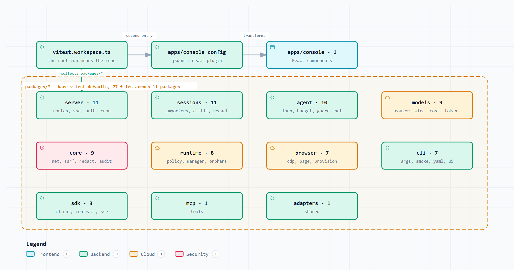
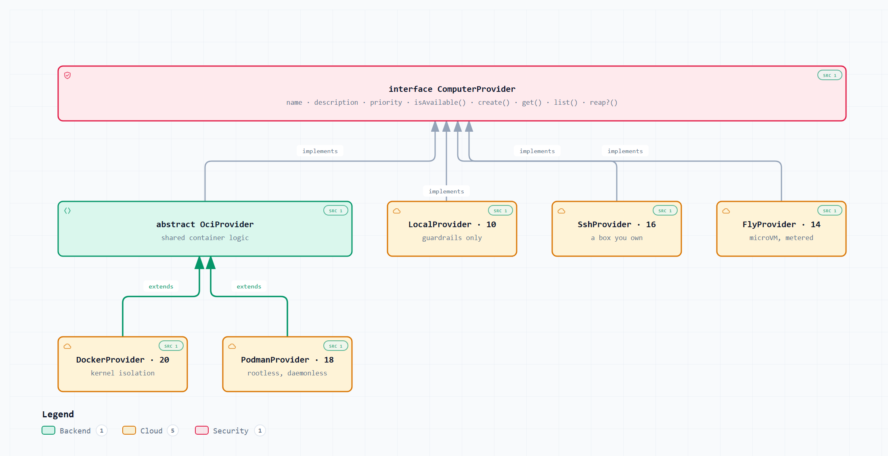
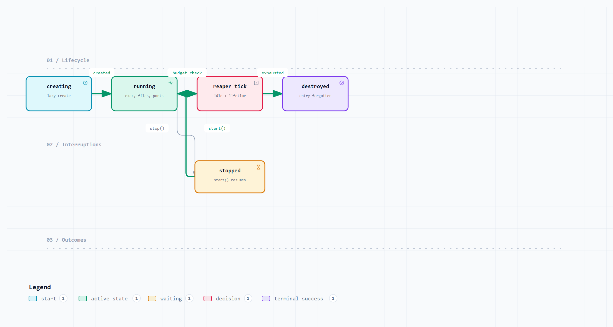

# Contributing

## Setup

```bash
npm install
npm run build
npm test
node packages/cli/dist/bin.js doctor
```

Node ≥ 20.10. Nothing else is required — no Docker, no API key. If any of those four
commands needs something you do not have, that is a bug worth reporting on its own.

The two websites sit outside the npm workspace on purpose. `apps/docs` and `apps/web`
each carry their own lockfile and install on demand:

```bash
cd apps/web && npm install && npm run dev
```

Neither shares code with the packages and CI builds neither, so fixing a bug in the
product never downloads Next, three.js or Tailwind — 628 fewer resolved packages in the
default install. `apps/console` stays in the workspace: it imports `@husk-ai/core`,
`@husk-ai/sdk` and `@husk-ai/browser`, and `husk serve` serves its build.

## How the pieces fit

Before changing anything, know where it sits. Every box below maps to a real package:

<picture>
  <source media="(prefers-color-scheme: dark)" srcset="docs/diagrams/png/02-system-architecture.dark.png">
  
</picture>

<sub>[Open interactively](docs/diagrams/02-system-architecture.html) — click any box to trace its dependencies · [all 16 diagrams](docs/diagrams/)</sub>

## Read this first

[`docs/BUILD-CONTRACT.md`](docs/BUILD-CONTRACT.md) is the set of rules every package
obeys. It is short, and it is not optional. The parts that trip people up:

- **ESM only, and relative imports carry `.js`.** NodeNext resolution.
- **No native modules.** Ever. A Windows `npm install` must be clean without a C++
  toolchain, which is worth more than SQLite would be.
- **Dependencies run downhill.** `core` ← `runtime`/`models`/`sessions` ← `agent` ←
  `mcp`/`server`/`adapters` ← `cli`. Never sideways, never up, never into another
  package's `src/`.
- **Two tsconfigs per package.** `tsconfig.json` for typecheck, `tsconfig.build.json`
  for build. Compiled tests must not ship.

## The values that show up in code review

**Every error is actionable.** Throw `HuskError` with a code and a one-line `hint` that
names the fix. "docker is installed but the daemon is not reachable → start Docker
Desktop" is the standard. "Install Docker" when Docker is already installed is a bug we
have actually shipped and fixed.

**Never claim isolation you do not provide.** `Availability.isolationKind` exists
because a boolean overclaimed for `ssh`. If you add a provider, be precise about what
its boundary actually is, in the code and in `husk doctor`.

**The free path is the default path.** No API key, no Docker, no account: everything
still runs. If a change makes a feature require one of those, it needs a fallback or it
needs to degrade with an explanation.

**Comments explain why.** A comment restating the line below it will be removed in
review. A comment explaining a non-obvious constraint — why `close` and not `exit`, why
`unshare -mr`, why the deny list is anchored to command position — is the point.

## Tests

Vitest, colocated as `src/**/*.test.ts`. Test the logic that would rot silently:
parsers, policy decisions, budget and retry maths, wire-format translation. Do not
write tests that assert a mock was called.

Every test must pass with **no Docker, no API key, no network**. The suite runs on a
laptop and in CI with nothing installed; if your test needs a daemon, it is testing the
daemon.

```bash
npx vitest run                       # everything
npx vitest run packages/runtime      # one package
npx vitest run -t "path jail"        # one description
```

### Where coverage is thin

<picture>
  <source media="(prefers-color-scheme: dark)" srcset="docs/diagrams/png/16-test-topology.dark.png">
  
</picture>

`mcp` has one test file against seven source modules, and `adapters` has one against
eight — and MCP is the main way husk actually gets used. That is the gap to watch, and
the best place to land a first contribution.

<sub>[Open interactively](docs/diagrams/16-test-topology.html)</sub>

## Before you open a PR

```bash
npm run build:packages && npm run typecheck && npm test
```

Then actually run the thing you changed. `husk doctor`, `husk up`, `husk exec` — the
CLI is the product's face, and a change that typechecks but reads badly in a terminal
is not done.

## Adding a computer provider

Implement `ComputerProvider` from `@husk-ai/core`. Here is what already exists and
where a new one would slot in:

<picture>
  <source media="(prefers-color-scheme: dark)" srcset="docs/diagrams/png/14-uml-provider-hierarchy.dark.png">
  
</picture>

Only the container pair share a base. `local`, `ssh` and `fly` implement the interface
directly — if yours is not container-shaped, do the same rather than forcing it through
`OciProvider`.

The bar:

- `isAvailable()` never throws, and distinguishes *not installed* from *installed but
  not running* from *installed and refusing this user*, each with its own hint.
- Set `isolationKind` honestly.
- Reuse `policy.ts` — the path jail, command policy, env scrubbing and `OutputBuffer`
  are shared so a command refused in one place is refused everywhere.
- Tests pass without the underlying tool installed.

Your provider drives this state machine, so handle every transition it can reach:

<picture>
  <source media="(prefers-color-scheme: dark)" srcset="docs/diagrams/png/15-computer-lifecycle.dark.png">
  
</picture>

Two states you will not command: `paused` is reported by docker and fly but husk never
sets it, and `error` is terminal.

<sub>[Provider hierarchy](docs/diagrams/14-uml-provider-hierarchy.html) · [lifecycle](docs/diagrams/15-computer-lifecycle.html) · [core contracts](docs/diagrams/13-uml-core-contracts.html)</sub>

## Adding a model provider

If it speaks the OpenAI dialect, add a configuration to `src/providers/compatible.ts`
— base URL, env var, catalogue slice, any header quirk. Do not copy the OpenAI provider.
If it does not, write the translation properly, as `google.ts` does.

`isAvailable()` must report the exact environment variable in its hint, and must never
throw when the key is missing.

## Commits

Present tense, explain the why in the body when it is not obvious. No emoji, no
Conventional Commits ceremony.

## Reference

Sixteen diagrams cover the architecture, data flows, contracts and lifecycles —
[`docs/diagrams/`](docs/diagrams/). Each ships a PNG, an SVG, an interactive HTML
viewer with pan/zoom and relationship tracing, and the JSON spec it was generated from.

Worth knowing before a deep change:

| If you are touching | Read |
| --- | --- |
| A tool, or the MCP surface | [one `shell` call end to end](docs/diagrams/12-lld-mcp-shell-call.html) |
| Policy, jails, or redaction | [trust boundaries](docs/diagrams/05-trust-boundaries.html) · [a `shell` call on `local`](docs/diagrams/09-dfd3-shell-call.html) |
| Computer creation or reuse | [inside the computer manager](docs/diagrams/08-dfd2-computer-manager.html) |
| Types in `@husk-ai/core` | [the core contracts](docs/diagrams/13-uml-core-contracts.html) |
| Ports, processes, or `husk serve` | [high-level design](docs/diagrams/11-hld-runtime.html) |

Where a diagram and a doc disagree, the diagram follows the code.
