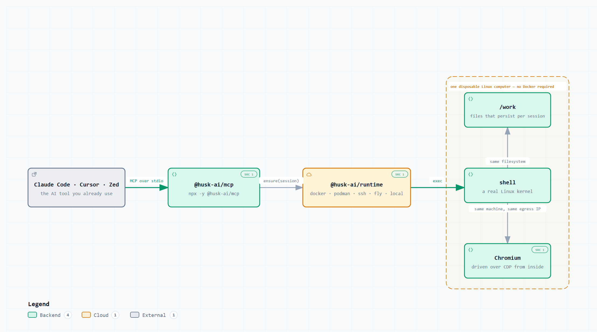
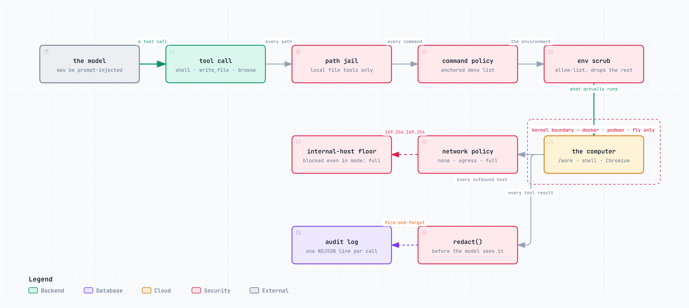

<div align="center">
  <picture>
    <source media="(prefers-color-scheme: dark)" srcset="brand/logo/lockup-horizontal.svg">
    <source media="(prefers-color-scheme: light)" srcset="brand/logo/lockup-horizontal.svg">
    
  </picture>

  <p><strong>Give your AI chat a real computer of its own.</strong></p>

  <p>
    <a href="https://github.com/Hotragn/husk/actions/workflows/ci.yml"></a>
    <a href="https://www.npmjs.com/package/@husk-ai/cli"></a>
    
    <a href="LICENSE"></a>
  </p>
</div>

Your AI chat can write a script. It cannot run it.

Ask for a scraper and you get code to paste somewhere yourself. Ask again tomorrow and
the files from today are gone. It cannot install a package, keep a login, or check
whether the thing it just wrote actually works.

Husk hands it a Linux computer instead. A shell, a filesystem at `/work` that outlives
the conversation, and a browser whose login survives from one page to the next. One line
to set up. Runs on hardware you already have, with no account and no API key.

> [!NOTE]
> Husk is in **early alpha** — everything works, things are moving fast, and your feedback shapes what comes next. [Jump in](https://github.com/Hotragn/husk/discussions).

<picture>
  <source media="(prefers-color-scheme: dark)" srcset="docs/diagrams/png/01-hero.dark.png">
  
</picture>

<sub>[Open interactively](docs/diagrams/01-hero.html) — pan, zoom, trace relationships · [SVG](docs/diagrams/svg/01-hero.light.svg) · [all 16 diagrams](docs/diagrams/)</sub>

## Install

```bash
claude mcp add husk -- npx -y @husk-ai/mcp
```

That is the whole setup. Nothing is created until the first tool call, so an installed
husk that nobody uses costs nothing. Works with Cursor, Zed, or anything else that
speaks MCP.

Your agent gets 21 tools. Eight for the machine — `shell`, `read_file`, `write_file`,
`edit_file`, `list_dir`, `expose_port`, `browse`, `computer_info` — and thirteen
`browser_*` tools that drive a real Chromium inside that same machine, addressed by
accessibility ref rather than pixel coordinates.

The first tool result says what kind of machine it got. A model that thinks it is
sandboxed when it is not makes worse decisions than one that knows.

## The CLI

```bash
npx @husk-ai/cli onboard                 # guided setup, five steps, start here
npx @husk-ai/cli doctor                  # or go straight to what this machine can offer
npx @husk-ai/cli up dev --flavor python  # bring up a Linux computer
npx @husk-ai/cli exec dev -- 'uname -sr && python3 -V'
npx @husk-ai/cli rm dev                  # tear it down
```

`onboard` names your provider and how isolated it really is, creates a computer and
destroys it in front of you, points at the shortest route to a model if you have none,
and prints the MCP line for your editor. It never asks for an API key — husk reads
credentials from the environment and does not store them, so it prints the `export` line
and re-checks.

On Windows `cmd.exe`, use double quotes -- it does not strip single ones, so the
quotes would reach the container as part of the command:

```bat
npx @husk-ai/cli exec dev -- "uname -sr && python3 -V"
```

`--flavor python` is there because the default `base` flavour is
`debian:bookworm-slim`, which has no `python3` -- and a quickstart whose third line
prints `python3: not found` is not a quickstart. On a laptop with Docker running, that
sequence prints `Linux 6.18.33.2-microsoft-standard-WSL2` and `Python 3.12.14`; with
Docker stopped and WSL2 installed it picks `local` and prints the same kernel with the
distro's own `Python 3.14.4`. `doctor` reports every provider it probed, which one it
would pick, and why the others were skipped.

## Turn a chat into a bot

A conversation that worked once becomes a file you can run again.

```bash
husk import                          # lists transcripts it found
husk import --pick 1                 # imports one, prints its id
husk distill <id> --out triage.yaml  # conversation → agent spec
husk run triage.yaml "check the build"
```

Importers read Claude Code JSONL, ChatGPT, Cursor, Gemini and markdown into one
`Transcript`. Branched threads are rebuilt by walking `parentUuid` back from the last
leaf. The distiller runs with no API key at all, and the model-backed mode falls back to
that free path rather than failing. Secrets are stripped before the file is written,
not after.

What comes out is YAML you can read and diff:

```yaml
name: triage
model: sonnet
persona: |
  You triage CI failures for a TypeScript monorepo.
  Always read the failing job log before guessing.
tools: [computer, files]
computer:
  flavor: node
  network: { mode: egress, allow: ['*.github.com'] }
limits: { maxSteps: 24, maxCostUsd: 0.25 }
```

`husk distill` prints its confidence and everything it could not work out, so a thin
transcript announces itself instead of producing a plausible-looking persona nobody
checks. Five worked examples live in [`examples/`](examples/).

## What is in it

- **A machine, not an interpreter.** Files, a shell, ports, a browser. `/work` survives
  the whole session, and `persist` keeps it past that.
- **Five computer providers.** `docker`, `podman`, `ssh`, `fly`, `local`. One interface;
  `auto` takes the highest available.
- **Eleven model providers.** Ollama, Anthropic, OpenAI, Google, Groq, DeepSeek,
  Cerebras, OpenRouter, Mistral, Together, LM Studio. Aliases resolve across all of
  them, so one `husk.yaml` runs on Opus or on a local Gemma.
- **Four adapters.** Discord, Slack, Telegram, webhook.
- **No telemetry.** Not off by default. Absent. There is no analytics call, no crash
  reporter, no version ping.
- **No native modules.** `npm install` finishes on Windows with no C++ toolchain. Node
  20.10 or newer.
- **1,739 tests across 100 files**, passing with no API key and no network. Twenty-two of
  them are the container half of the workspace-conformance matrix and skip when no Docker
  daemon answers; the rest do not need one.

## How it works

<picture>
  <source media="(prefers-color-scheme: dark)" srcset="docs/diagrams/png/02-system-architecture.dark.png">
  
</picture>

Eleven packages and three apps. Dependencies run downhill: the other ten packages
import `@husk-ai/core`, core imports nothing from the workspace, and nothing imports
`@husk-ai/cli`.

```
packages/
  core         contracts, husk.yaml schema, primitives
  runtime      computer providers: docker, podman, local, ssh, fly
  models       one surface over eleven model providers
  sessions     transcript importers + the distiller
  browser      Chromium lifecycle and CDP automation
  agent        tool-calling loop and built-in tools
  adapters     Discord, Slack, Telegram, webhook
  mcp          MCP server (stdio)
  server       control-plane API + bot host
  sdk          typed client for the control plane
  cli          the husk command
apps/
  console      dashboard: live terminal, files, browser
  docs         documentation site (Next.js + MDX)
  web          marketing site (Next.js + Three.js)
```

`server` reaches `@husk-ai/agent` through a dynamic import and never declares it as a
dependency, so the control plane starts on a tree where the agent was never built.

Four flavours choose the image: `base`, `python`, `node`, `full`. Husk publishes none of
its own. `base` is `debian:bookworm-slim`, `python` is `python:3.12-slim`, `node` is
`node:22-slim`, and `full` is Playwright's image, which already carries the twenty-odd
shared libraries Chromium links against. An image you publish is an operating system you
have promised to keep patched, and Debian and the Playwright team already do that better.
Set `HUSK_REGISTRY` to point the lot at your own mirror.

<sub>[Open interactively](docs/diagrams/02-system-architecture.html) · [SVG](docs/diagrams/svg/02-system-architecture.light.svg)</sub>

## Providers

`auto` walks the ladder and takes the highest rung that answers. Every rung is free
except `fly`, which is metered. An explicit `--provider` that turns out to be
unavailable is an error, never a quiet downgrade to weaker isolation.

| Provider | Priority | Isolation | Cost | Notes |
| --- | --- | --- | --- | --- |
| `docker` | 20 | Kernel namespaces, cgroups, seccomp, read-only root | Free | Default when the daemon is up |
| `podman` | 18 | Kernel, rootless | Free | Linux without Docker |
| `ssh` | 16 | Whatever the remote gives you | Free if you own the box | An Oracle Always Free instance, a Pi, a VPS |
| `fly` | 14 | microVM | Metered | Bursty parallel work |
| `local` | 10 | **Guardrails only** | Free | WSL2 gives real Linux; POSIX runs your own shell with guardrails |

> **The `local` provider is not a sandbox.** It stops accidents, not adversaries.
> `husk doctor` reports `isolated: false` for it, and the first MCP tool result says so
> again.

## Security model

<picture>
  <source media="(prefers-color-scheme: dark)" srcset="docs/diagrams/png/05-trust-boundaries.dark.png">
  
</picture>

These hold in every mode, `local` included, and were re-checked against a live `local`
and a live `docker` computer for 0.1.4: the command deny list, the environment scrub,
output caps, process-tree kill, `redact()` on every result and `audited()` on every MCP
call.

The path jail is not one of them, and this paragraph used to say it was
([#120](https://github.com/Hotragn/husk/issues/120)). It is a `local` control, and there
it confines the file tools rather than the shell. On `docker`, `podman` and `fly` the
container *is* the boundary, so the file tools address the container's own filesystem:
`read_file /etc/passwd` returns the container's copy, and `/dev/shm` takes a write.
Neither reaches your machine, which is the point of running those providers — a jail
inside a kernel boundary is largely redundant. Claiming one anyway is exactly what this
section exists not to do.

What `local` does not give you is a kernel boundary. It shares your kernel, your network
and your user account.

`169.254.169.254` stays blocked even under `network.mode: full`, because `full` means
the internet and not the cloud metadata service that hands IAM credentials to whatever
asks. Loopback and the RFC1918 ranges are the same problem one hop out. An operator who
wants one of them names it in `allow`, where a reviewer reading the `husk.yaml` can see
the decision.

Address spellings are normalised first. `127.1`, `2130706433` and `0x7f000001` are all
`127.0.0.1` to curl, to Chromium and to Python's urllib, so a rule that only understands
four dotted octets is not a rule.

<sub>[Open interactively](docs/diagrams/05-trust-boundaries.html) · [SVG](docs/diagrams/svg/05-trust-boundaries.light.svg)</sub>

## Documentation

- **[Architecture](docs/ARCHITECTURE.md)** — why it is shaped this way
- **[API reference](docs/API.md)** — the control-plane HTTP contract
- **[Build contract](docs/BUILD-CONTRACT.md)** — conventions every package obeys
- **[Security model](docs/SECURITY-MODEL.md)** — what is isolated and what is not
- **[Examples](examples/)** — five `husk.yaml` recipes and an MCP session demo
- **[Diagrams](docs/diagrams/)** — 16 interactive architecture, dataflow and design diagrams

## Status

Alpha, pre-1.0. The `husk.yaml` schema and the HTTP contract can still change between
releases. What is known not to work today:

- **The rendered browser is only confirmed on `local`.** The thirteen `browser_*` tools
  drive Chromium there today. On the container providers the root filesystem is mounted
  read-only, so Chromium's shared libraries have to arrive in the image rather than
  through a package manager, and that path is still being worked out. `browse`, which
  fetches a page and strips the tags, works everywhere.
- **`fly` is the least exercised provider.** It has tests. It has far fewer real hours
  than `docker` and `local`.

## Development

```bash
git clone https://github.com/Hotragn/husk.git && cd husk
npm install
npm run build
npm test
```

## Contributing

Contributions are welcome. [CONTRIBUTING.md](CONTRIBUTING.md) covers the build contract,
the test requirements, and how to add a provider or a model.

## Contributors

Everyone who has shipped something here is on the
[contributors graph](https://github.com/Hotragn/husk/graphs/contributors), which counts
commits rather than asking anyone to remember to add a name.

## License

[Apache-2.0](LICENSE)
