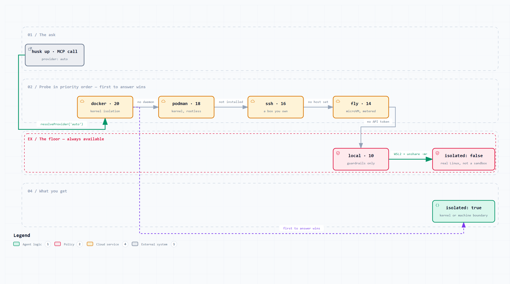
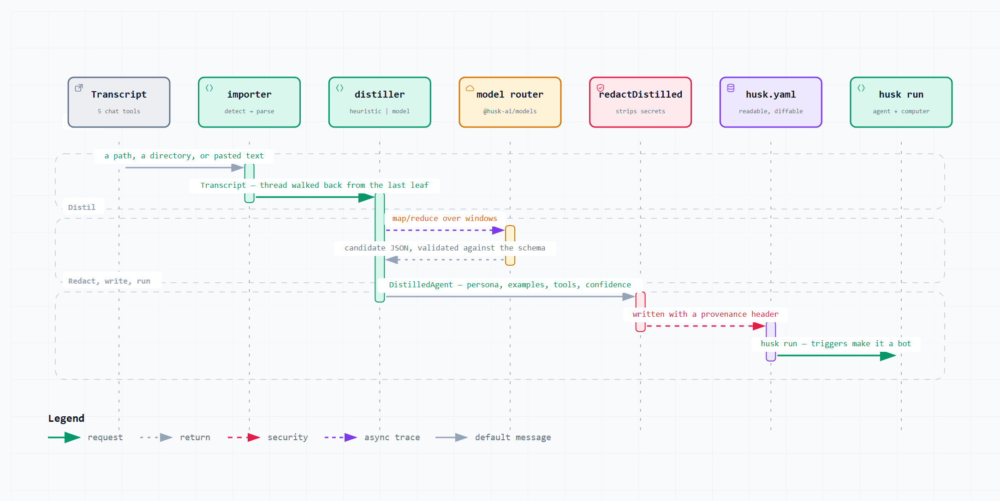
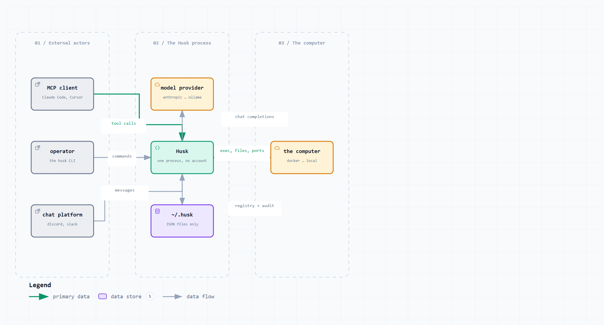
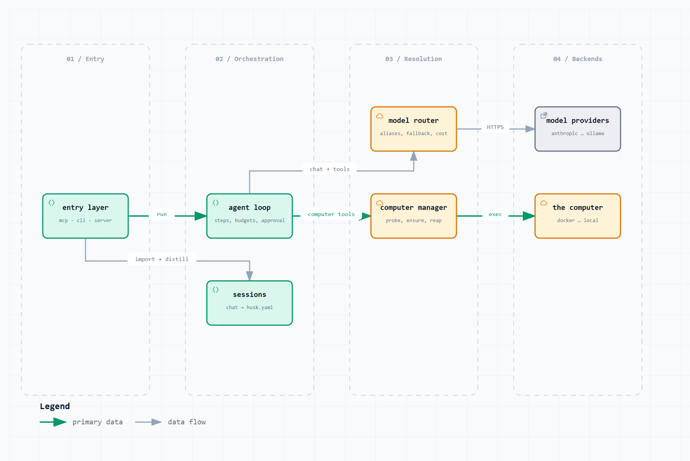
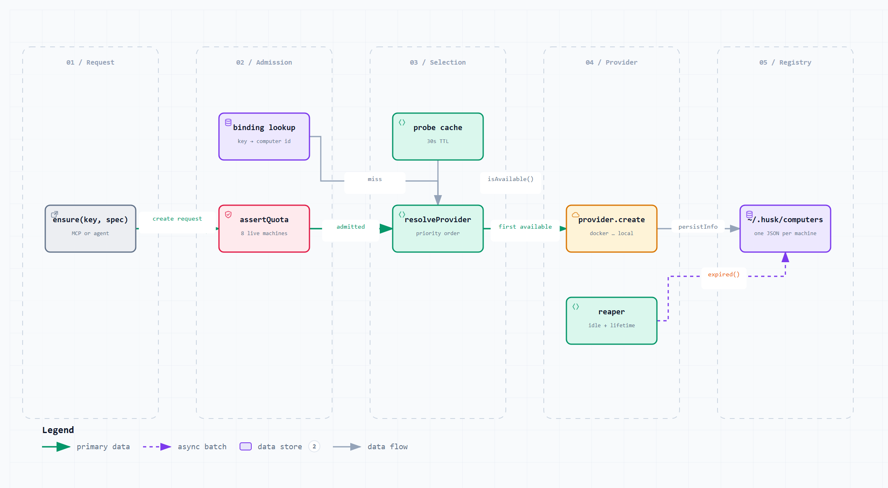
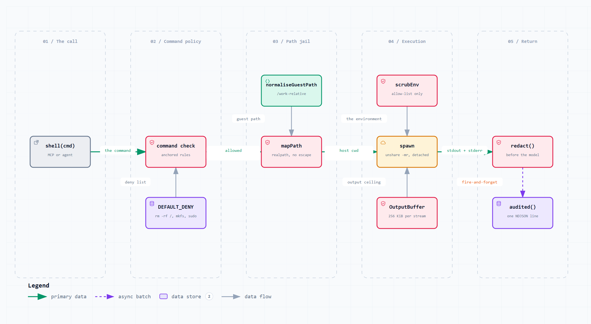
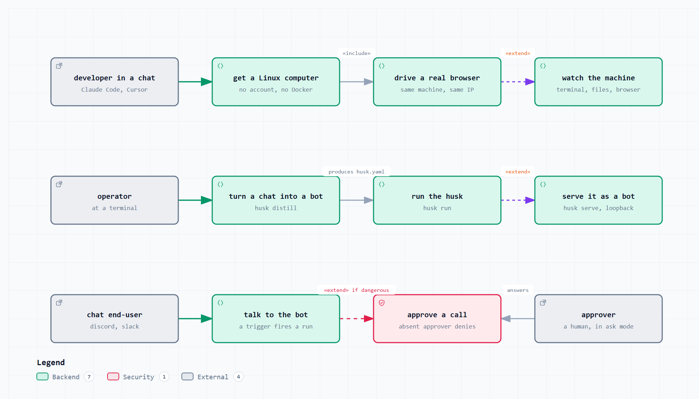
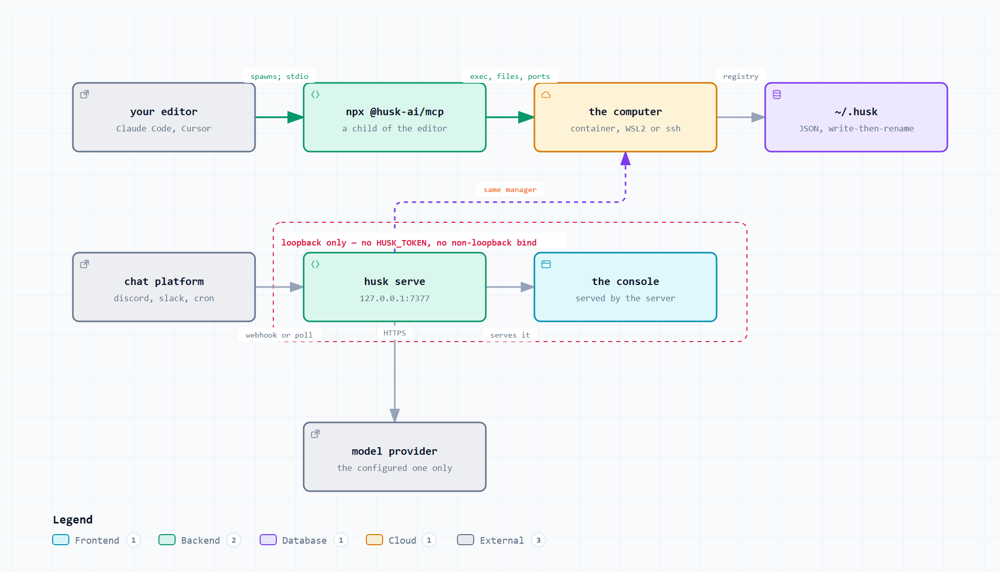
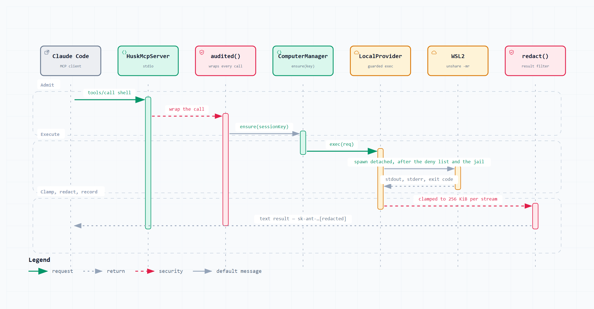
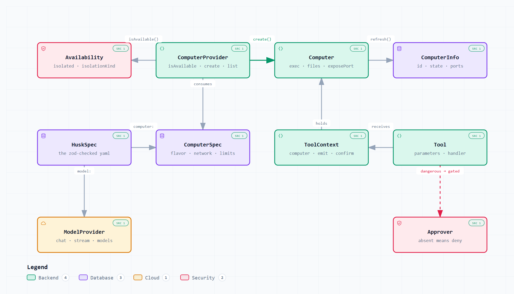

# Diagrams

Sixteen diagrams of husk, generated from typed specifications with
[archify](https://github.com/tt-a1i/archify).

Every box maps to a real file or package. Where a diagram and a doc disagree,
the diagram follows the code.

## Which format to use where

| Format | Use it for | Notes |
| --- | --- | --- |
| `png/<name>.<theme>.png` | GitHub READMEs, issues, PRs, wikis, npm, slides | Renders everywhere, no exceptions. 2× for retina. |
| `svg/<name>.<theme>.svg` | Docs sites, print, anywhere you need to zoom | Self-contained — no stylesheet, no web font, no script. ~⅕ the bytes of the PNG. |
| `<name>.html` | Reading a diagram properly | Pan/zoom, search, relationship tracing, export. Open it directly; no server needed. |
| `<name>.<type>.json` | Editing | The source of truth. Re-render after any change. |

Each diagram ships a `light` and a `dark` variant. The embeds below use
`<picture>`, so GitHub serves whichever matches the reader's theme.

### Using one elsewhere

Inside this repo (e.g. the root `README.md`):

```markdown
<picture>
  <source media="(prefers-color-scheme: dark)" srcset="docs/diagrams/png/01-hero.dark.png">
  
</picture>
```

Outside it (npm, a blog, another repo) — absolute raw URLs:

```markdown

```

npm renders README images but ignores `<picture>`, so point it straight at the
light PNG.

---

## 1 · Hero

Chat → husk → a computer with files, a terminal and a browser. No Docker required.

<picture>
  <source media="(prefers-color-scheme: dark)" srcset="png/01-hero.dark.png">
  
</picture>

[SVG](svg/01-hero.light.svg) · [interactive](01-hero.html) · [spec](01-hero.architecture.json)

## 2 · System architecture

All 11 packages, 3 apps, the four entry points, and `@husk-ai/core` underneath.

<picture>
  <source media="(prefers-color-scheme: dark)" srcset="png/02-system-architecture.dark.png">
  
</picture>

- Dependencies run downhill. All 10 packages import `@husk-ai/core`; core imports nothing from the workspace; nothing imports `@husk-ai/cli`.
- The dashed edges are dynamic imports, not package dependencies — `cli → server`, `cli → mcp`, `server → agent`. The server starts without the agent built.
- `apps/docs` and `apps/web` have no `@husk-ai/*` dependency at all.

[SVG](svg/02-system-architecture.light.svg) · [interactive](02-system-architecture.html) · [spec](02-system-architecture.architecture.json)

## 3 · Provider selection

The scoring ladder, and what you still get at the bottom of it.

<picture>
  <source media="(prefers-color-scheme: dark)" srcset="png/03-provider-ladder.dark.png">
  
</picture>

- Every rung is free except `fly`, which is metered.
- An explicit `--provider` that is unavailable is an error, never a silent downgrade to something with weaker isolation.
- No Docker? `local` still gives you a real Linux computer — on Windows via WSL2 under `unshare -mr`, so `/work` is a real mount. It reports `isolated: false`, because it is.

[SVG](svg/03-provider-ladder.light.svg) · [interactive](03-provider-ladder.html) · [spec](03-provider-ladder.workflow.json)

## 4 · chat → bot

A transcript becomes a `husk.yaml` you can read, diff and run.

<picture>
  <source media="(prefers-color-scheme: dark)" srcset="png/04-chat-to-bot.dark.png">
  
</picture>

- Importers normalise Claude Code JSONL, ChatGPT, Cursor, Gemini and markdown into one `Transcript`. Branched threads are rebuilt by walking `parentUuid` back from the last leaf.
- The heuristic distiller is the one that runs with no API key, so it has to be good. The model-backed mode falls back to it rather than failing.
- Secrets are stripped before the file is written, not after.

[SVG](svg/04-chat-to-bot.light.svg) · [interactive](04-chat-to-bot.html) · [spec](04-chat-to-bot.sequence.json)

## 5 · Trust boundaries

What crosses which line — and what `local` does **not** give you.

<picture>
  <source media="(prefers-color-scheme: dark)" srcset="png/05-trust-boundaries.dark.png">
  
</picture>

- Holds in **every** mode including `local`: path jail, command deny list, env scrub, output caps, process-tree kill, `redact()` on every result, `audited()` on every MCP call.
- `local` gives **no kernel boundary**. It shares your kernel, your network and your user account. The deny list stops accidents, not an adversary.
- `169.254.169.254` is blocked even in `mode: full` — `full` means the internet, not the cloud metadata service.
- Honest limits: `mode: egress` is enforced at the tool layer, not by a firewall; a raw socket is not stopped. An empty allow-list permits nothing. Approval with no approver wired denies.

[SVG](svg/05-trust-boundaries.light.svg) · [interactive](05-trust-boundaries.html) · [spec](05-trust-boundaries.architecture.json)

---

## Data-flow decomposition

### 6 · DFD level 0 — context

<picture>
  <source media="(prefers-color-scheme: dark)" srcset="png/06-dfd0-context.dark.png">
  
</picture>

No database — state is JSON files under `~/.husk`. No control plane, no account.
No telemetry: not off by default, absent.

[SVG](svg/06-dfd0-context.light.svg) · [interactive](06-dfd0-context.html) · [spec](06-dfd0-context.dataflow.json)

### 7 · DFD level 1 — the subsystems

<picture>
  <source media="(prefers-color-scheme: dark)" srcset="png/07-dfd1-subsystems.dark.png">
  
</picture>

[SVG](svg/07-dfd1-subsystems.light.svg) · [interactive](07-dfd1-subsystems.html) · [spec](07-dfd1-subsystems.dataflow.json)

### 8 · DFD level 2 — inside the computer manager

<picture>
  <source media="(prefers-color-scheme: dark)" srcset="png/08-dfd2-computer-manager.dark.png">
  
</picture>

`ensure(key)` maps a stable key to a machine, so one conversation keeps one
filesystem. Probes are cached for 30s because `docker version` on a cold daemon
costs ~800 ms and agents are chatty.

[SVG](svg/08-dfd2-computer-manager.light.svg) · [interactive](08-dfd2-computer-manager.html) · [spec](08-dfd2-computer-manager.dataflow.json)

### 9 · DFD level 3 — one `shell` call on `local`

<picture>
  <source media="(prefers-color-scheme: dark)" srcset="png/09-dfd3-shell-call.dark.png">
  
</picture>

The real order from `local.ts`: command policy first, then the path jail, then
the environment scrub — only then is anything spawned. Rules anchor to command
position, so `grep -r "sudo" .` still works.

[SVG](svg/09-dfd3-shell-call.light.svg) · [interactive](09-dfd3-shell-call.html) · [spec](09-dfd3-shell-call.dataflow.json)

---

## Design and structure

### 10 · Use cases

<picture>
  <source media="(prefers-color-scheme: dark)" srcset="png/10-use-cases.dark.png">
  
</picture>

[SVG](svg/10-use-cases.light.svg) · [interactive](10-use-cases.html) · [spec](10-use-cases.architecture.json)

### 11 · High-level design — processes, ports, boundaries

<picture>
  <source media="(prefers-color-scheme: dark)" srcset="png/11-hld-runtime.dark.png">
  
</picture>

`husk serve` binds loopback and refuses a non-loopback address without
`HUSK_TOKEN`. The MCP process is passive — it never starts a server.

[SVG](svg/11-hld-runtime.light.svg) · [interactive](11-hld-runtime.html) · [spec](11-hld-runtime.architecture.json)

### 12 · Low-level design — one MCP `shell` call, end to end

<picture>
  <source media="(prefers-color-scheme: dark)" srcset="png/12-lld-mcp-shell-call.dark.png">
  
</picture>

[SVG](svg/12-lld-mcp-shell-call.light.svg) · [interactive](12-lld-mcp-shell-call.html) · [spec](12-lld-mcp-shell-call.sequence.json)

### 13 · UML — the `@husk-ai/core` contracts

<picture>
  <source media="(prefers-color-scheme: dark)" srcset="png/13-uml-core-contracts.dark.png">
  
</picture>

[SVG](svg/13-uml-core-contracts.light.svg) · [interactive](13-uml-core-contracts.html) · [spec](13-uml-core-contracts.architecture.json)

### 14 · UML — the provider hierarchy

<picture>
  <source media="(prefers-color-scheme: dark)" srcset="png/14-uml-provider-hierarchy.dark.png">
  
</picture>

Only the container pair share a base. `local`, `ssh` and `fly` implement the
interface directly — no forced abstraction.

[SVG](svg/14-uml-provider-hierarchy.light.svg) · [interactive](14-uml-provider-hierarchy.html) · [spec](14-uml-provider-hierarchy.architecture.json)

### 15 · Computer lifecycle

<picture>
  <source media="(prefers-color-scheme: dark)" srcset="png/15-computer-lifecycle.dark.png">
  
</picture>

Two states you will not see commanded: `paused` is reported by docker and fly
but husk never commands it, and `error` is terminal.

[SVG](svg/15-computer-lifecycle.light.svg) · [interactive](15-computer-lifecycle.html) · [spec](15-computer-lifecycle.lifecycle.json)

### 16 · Test topology

<picture>
  <source media="(prefers-color-scheme: dark)" srcset="png/16-test-topology.dark.png">
  
</picture>

`mcp` has 1 test file against 7 source modules and `adapters` has 1 against 8 —
and MCP is the main way husk gets used. That is the gap to watch.

[SVG](svg/16-test-topology.light.svg) · [interactive](16-test-topology.html) · [spec](16-test-topology.architecture.json)

---

## Regenerating

Edit the `.json` spec, then re-render and re-export:

```bash
node ~/.agents/skills/archify/bin/archify.mjs deliver architecture docs/diagrams/02-system-architecture.architecture.json docs/diagrams/02-system-architecture.html --quality showcase --repo-root .
node docs/diagrams/export.mjs docs/diagrams docs/diagrams
```

Pass the matching type (`architecture`, `workflow`, `sequence`, `dataflow`,
`lifecycle`). `--repo-root .` is required for, and only supported by, the
architecture diagrams — they are the ones that declare `sources` evidence, which
is resolved against the working tree at render time.

`export.mjs` drives headless Chrome over CDP, lifts the `<svg>` out of each
viewer with its computed styles inlined, fits the viewBox to real content bounds
(the authored box clips the legend), and rasterises the exported SVG — so the
PNG is a render of the file actually being shipped rather than of a page that
merely looks right.

All sixteen pass `--quality showcase` with 9/9 artifact checks, 0 composition
errors and 0 warnings, and `visual-check` clean at 1440×900 through 2048×1320 in
both themes.

## One place the code and the docs disagree

`docs/ARCHITECTURE.md` describes `@husk-ai/mcp` as "stdio + streamable HTTP" and
says the same server runs over streamable HTTP for remote clients. It does not.
`packages/mcp/src/server.ts:139` constructs a `StdioServerTransport` and that is
the only transport in the package; `docs/SPEC-remote-mcp.md` records the remote
transport as *proposed, not started* and names that same line as the blocker.
Diagrams 01, 02, 11 and 12 draw stdio only.
